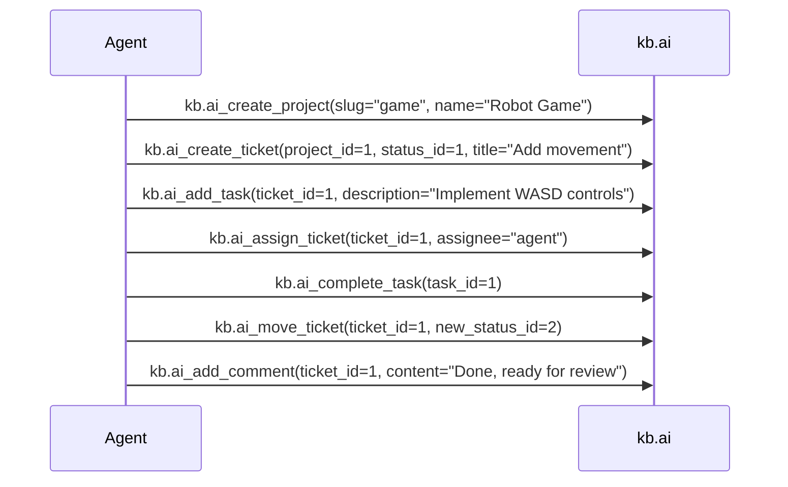

# kb.ai MCP Server Usage

## Installation

```bash
nix profile install codeberg:danszek/kb.ai
```

Or build from source:

```bash
git clone https://codeberg.org/danszek/kb.ai.git
cd kb.ai
nix run .
```

## Database Setup

1. Ensure PostgreSQL is running.
2. Apply migrations:

```bash
psql -U postgres -d kb_ai -f migrations/V1__Initial_Multi_Project_Kanban_Schema.sql
```

3. Create at least one project and its status columns manually, or via the tools.

## Environment Variables

| Variable | Default | Description |
|----------|---------|-------------|
| `KB_AI_DB_HOST` | `localhost` | PostgreSQL host |
| `KB_AI_DB_PORT` | `5432` | PostgreSQL port |
| `KB_AI_DB_NAME` | `kb_ai` | Database name |
| `KB_AI_DB_USER` | `postgres` | Database user |
| `KB_AI_DB_PASSWORD` | *(empty)* | Database password |

## MCP Tools

All tools are prefixed with `kb.ai_`.

### Projects

#### `kb.ai_create_project`

Create a new Kanban project.

**Parameters:**
- `slug` (string, required): URL-friendly project identifier (e.g. `my-robot-game`)
- `name` (string, required): Human-readable project name

**Returns:** Project object with `id`, `slug`, `name`, `created_at`.

#### `kb.ai_list_projects`

List all projects.

**Parameters:** None

**Returns:** Array of project objects.

#### `kb.ai_get_project`

Get project details including its board statuses.

**Parameters:**
- `project_id` (integer, required): Project ID

**Returns:** Project object with `statuses` array.

### Tickets

#### `kb.ai_create_ticket`

Create a new ticket in a project.

**Parameters:**
- `project_id` (integer, required): Project ID
- `status_id` (integer, required): Initial board status ID
- `title` (string, required): Ticket title
- `description` (string, optional): Ticket description

**Returns:** Ticket object with `id`, `title`, `status`, `assignee`, etc.

#### `kb.ai_get_ticket`

Get ticket details.

**Parameters:**
- `ticket_id` (integer, required): Ticket ID

**Returns:** Ticket object.

#### `kb.ai_get_ticket_detailed`

Get ticket with tasks, documents, and comments.

**Parameters:**
- `ticket_id` (integer, required): Ticket ID

**Returns:** Ticket object with `tasks`, `documents`, `comments` arrays.

#### `kb.ai_list_tickets`

List tickets in a project, optionally filtered by status.

**Parameters:**
- `project_id` (integer, required): Project ID
- `status_id` (integer, optional): Filter by status column

**Returns:** Array of ticket objects.

#### `kb.ai_update_ticket`

Update ticket title/description.

**Parameters:**
- `ticket_id` (integer, required): Ticket ID
- `title` (string, optional): New title
- `description` (string, optional): New description

**Returns:** Updated ticket object.

#### `kb.ai_move_ticket`

Move ticket to another status column.

**Parameters:**
- `ticket_id` (integer, required): Ticket ID
- `new_status_id` (integer, required): Target status ID

**Note:** The database enforces workflow transitions via `status_transitions` table. Illegal moves are rejected with a detailed error message.

#### `kb.ai_assign_ticket`

Assign or unassign a ticket.

**Parameters:**
- `ticket_id` (integer, required): Ticket ID
- `assignee` (string or null, required): Username to assign, or `null` to unassign

### Tasks (Acceptance Criteria)

#### `kb.ai_add_task`

Add a task (acceptance criterion) to a ticket.

**Parameters:**
- `ticket_id` (integer, required): Ticket ID
- `description` (string, required): Task description

#### `kb.ai_complete_task`

Mark a task as completed.

**Parameters:**
- `task_id` (integer, required): Task ID

**Note:** A ticket cannot be moved to a `done` status if any of its tasks are incomplete.

### Comments

#### `kb.ai_add_comment`

Add a comment to a ticket.

**Parameters:**
- `ticket_id` (integer, required): Ticket ID
- `content` (string, required): Comment text

#### `kb.ai_list_comments`

List comments on a ticket.

**Parameters:**
- `ticket_id` (integer, required): Ticket ID

**Returns:** Array of comments with `author`, `content`, `created_at`.

## AI Coding Agent Configuration

### Claude Code (opencode)

```json
{
  "mcpServers": {
    "kb.ai": {
      "command": "nix",
      "args": ["run", "codeberg:danszek/kb.ai"]
    }
  }
}
```

### Cline / Roo Code

```json
{
  "mcpServers": {
    "kb.ai": {
      "command": "nix",
      "args": ["run", "codeberg:danszek/kb.ai"]
    }
  }
}
```

### Aider

```yaml
# .aider.mcp.json
{
  "mcpServers": {
    "kb.ai": {
      "command": "nix",
      "args": ["run", "codeberg:danszek/kb.ai"]
    }
  }
}
```

### Manual (without nix)

If you built the binary manually:

```json
{
  "mcpServers": {
    "kb.ai": {
      "command": "/path/to/kbai",
      "args": []
    }
  }
}
```

## Example Workflow



## Troubleshooting

- **"Connection refused"**: PostgreSQL not running or wrong connection params
- **"Illegal Kanban-Move"**: The transition is not defined in `status_transitions` for this project
- **"Open acceptance criteria"**: Cannot move to `done` with incomplete tasks
- **"Project/Status not found"**: Invalid `project_id` or `status_id` — verify via `kb.ai_get_project`
